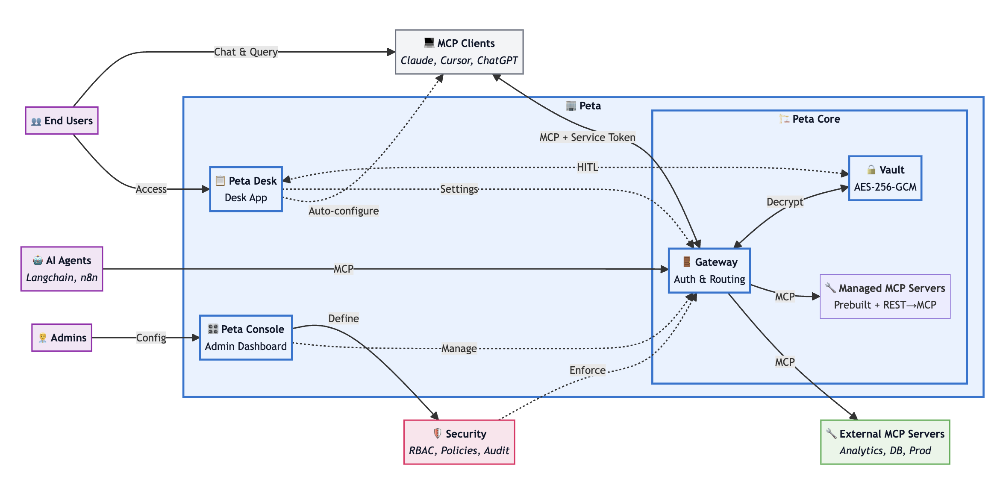

# Architecture

## System Architecture



### High-Level Overview

Kimbap Core implements a gateway pattern and plays two roles at the same time:

1. **MCP Server (to upstream clients)**  
   Exposes a standard MCP interface so agents and MCP-compatible clients can connect without custom plugins.

2. **MCP Client (to downstream servers)**  
   Manages connections to multiple MCP servers, multiplexing requests and applying policies before forwarding them.

Between those two sides the gateway adds:

- Authentication and session management.
- Permission evaluation (including human-in-the-loop checks).
- Credential injection from encrypted storage (the MCP vault).
- Rate limiting and IP filtering.
- Event persistence and reconnection support.
- Logging and audit trails.

From the agent's perspective there is only one MCP server. Behind that interface Kimbap Core handles the operational, security, and governance concerns.

### Gateway Responsibilities

Typical responsibilities inside the gateway include:

- Validating Kimbap access tokens (OAuth JWT or opaque) and resolving user/agent identity.
- Applying RBAC/ABAC policies, quotas, and network restrictions.
- Determining whether a request is allowed, blocked, or requires human approval.
- Injecting encrypted credentials into downstream MCP servers at execution time.
- Streaming responses back to clients via MCP and/or Socket.IO.
- Emitting structured logs and audit records for each operation.

---

## Project Structure

A simplified structure of this repository:

```text
.
├── cmd/
│   └── server/        # Application entry point (main.go)
├── internal/
│   ├── mcp/           # MCP proxy core (core/, service/, controller/, auth/, oauth/, types/)
│   ├── oauth/         # OAuth 2.0 implementation
│   ├── socket/        # Socket.IO real-time channel
│   ├── security/      # Authentication & authorization
│   ├── middleware/    # Chi middleware
│   ├── repository/    # Data access layer (GORM)
│   ├── logger/        # Zerolog logger
│   ├── config/        # Configuration and environment loading
│   ├── types/         # Shared types and enums
│   ├── admin/         # Admin API handlers
│   ├── user/          # User API handlers
│   ├── service/       # Application services
│   ├── log/           # Log service & sync
│   ├── database/      # Database connection & migrations
│   └── utils/         # Shared utilities
├── docs/
├── Dockerfile
├── docker-compose.yml
├── go.mod
├── go.sum
└── Makefile
```

See the `docs/` directory for API references and deployment guides. Architecture notes live in `../CLAUDE.md` and the `overview.png` diagram (there is no `docs/architecture/` directory in this repository).

### Data Flow Description

#### 1. Forward Request Flow (Client → Downstream)

```text
Client Initiates Request
  ↓
HTTP/HTTPS Server (chi v5)
  ↓
Middleware Chain (IP Check → Auth → Rate Limit)
  ↓
SessionStore (Get/Create ClientSession)
  ↓
ProxySession (Acts as MCP Server to receive request)
  ↓
RequestIdMapper (Map RequestID: client-id → proxy-id)
  ↓
Resource Namespace Parsing (read_file_-_filesystem → name + serverId)
  ↓
ServerManager (Get downstream server connection)
  ↓
Downstream MCP Server (ProxySession acts as MCP Client to send request)
  ↓
Response returns along the same path
```

#### 2. Reverse Request Flow (Downstream → Client)

```text
Downstream MCP Server Initiates Request (Sampling/Elicitation)
  ↓
ServerManager Receives (with relatedRequestId)
  ↓
GlobalRequestRouter (Lookup RequestContextRegistry)
  ↓
Locate Correct ProxySession
  ↓
RequestIdMapper (Reverse mapping: proxy-id → client-id)
  ↓
Forward to Client (via SSE)
  ↓
Client responds along the same path
```

#### 3. Socket.IO Real-time Communication

```text
Electron Client Connects
  ↓
Socket.IO Server (Token Authentication)
  ↓
Join Room (userId-based)
  ↓
Server Push Notifications
  - User Disabled / User Expired
  - Server Status Changes (Online/Offline/Error/Sleeping)
  - Online Session List Updates
  - Permission Changes
  ↓
Supports Multi-device Synchronization
```

#### 4. Event Persistence and Reconnection

```text
MCP Event Generated
  ↓
PersistentEventStore
  ↓
PostgreSQL (Persistent Storage)
  ↓
Client Disconnects and Reconnects
  ↓
Request with Last-Event-ID
  ↓
Restore Historical Events from EventStore
  ↓
Continue Session
```

### Core Design Patterns

1. **Multi-Role Proxy Pattern**
   - ProxySession acts as both MCP Server (upstream) and MCP Client (downstream)
   - Transparently forwards MCP protocol without client awareness of the middleware

2. **Singleton Shared Connections**
   - ServerManager as global singleton manages all downstream server connections
   - Multiple client sessions share the same set of downstream connections, avoiding duplicate establishment

3. **Three-Layer RequestID Mapping**
   - Client RequestID → Proxy RequestID → Server RequestID
   - Format: `{sessionId}:{originalId}:{timestamp}`
   - Prevents multi-client ID conflicts

4. **Reverse Request Routing**
   - Via GlobalRequestRouter + RequestContextRegistry
   - Downstream servers route back to correct client session via relatedRequestId

5. **Dual Logging Architecture**
   - zerolog: Structured operational logs (real-time monitoring)
   - LogService: Audit logs (database persistence)

6. **Resource Namespace Isolation**
   - Format: `{resourceName}_-_{serverId}` (separator is `_-_`, not `::`)
   - Examples: `read_file_-_filesystem`, `users_-_database`
   - Prevents resource name conflicts between different servers

---
